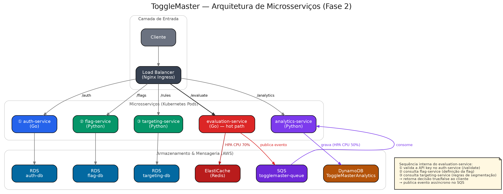

# 🚩 ToggleMaster — Fase 2

<p align="left">
  
  
  
  
  
  
</p>

Evolução do MVP monolítico da Fase 1 para uma arquitetura de **microsserviços
distribuídos**, conteinerizada e implantada em **Kubernetes na AWS (EKS)**,
com autoscaling horizontal.

> 🎥 **Vídeo de demonstração:** _[link a preencher]_
> 📄 **Relatório de entrega completo:** [`relatorio_entrega_fase2.pdf`](./relatorio_entrega_fase2.pdf)

---

## 📑 Sumário

- [Participantes](#-participantes)
- [Arquitetura](#-arquitetura)
- [Rodando localmente](#-rodando-localmente)
- [Infraestrutura AWS](#️-infraestrutura-aws)
- [Escalabilidade (HPA)](#-escalabilidade-hpa)
- [Desafios técnicos encontrados](#-desafios-técnicos-encontrados)
- [Manifestos Kubernetes](#-manifestos-kubernetes)

---

## 👤 Participantes

| Nome | RM | Discord |
|---|---|---|
| Leonardo Martins Silva | 371437 | _[preencher]_ |

---

## 🏗️ Arquitetura

O sistema é composto por 5 microsserviços independentes:

| Serviço | Linguagem | Responsabilidade | Persistência |
|---|---|---|---|
| 🔐 `auth-service` | Go | Gerencia chaves de API e autenticação | PostgreSQL (RDS) |
| 🚩 `flag-service` | Python | CRUD das definições das feature flags | PostgreSQL (RDS) |
| 🎯 `targeting-service` | Python | Regras de segmentação de usuários | PostgreSQL (RDS) |
| ⚡ `evaluation-service` | Go | Hot path: decide `true`/`false` de uma flag | Redis (ElastiCache) |
| 📊 `analytics-service` | Python | Consome eventos da fila e grava analytics | DynamoDB + SQS |

### Diagrama



### Fluxo de uma avaliação de flag

```
Cliente → Load Balancer (Nginx Ingress) → evaluation-service
   → valida chave via auth-service
   → consulta flag-service / targeting-service (cache em Redis)
   → retorna decisão (true/false)
   → dispara evento assíncrono → SQS → analytics-service → DynamoDB
```

### Por que 3 data stores diferentes?

- **RDS (PostgreSQL)** — dados relacionais e estruturados (chaves de API,
  definições de flags, regras de segmentação), onde consistência e relações
  entre tabelas importam.
- **ElastiCache (Redis)** — cache em memória de baixíssima latência, usado no
  `evaluation-service` (hot path) para evitar consultar o banco relacional a
  cada avaliação.
- **DynamoDB** — NoSQL, schema flexível e alta capacidade de escrita, ideal
  para o volume de eventos de analytics que chegam de forma assíncrona.

---

## 🐳 Rodando localmente

Pré-requisitos: Docker e Docker Compose.

```bash
docker compose up -d
docker compose ps
```

Isso sobe os 5 microsserviços + 3 instâncias PostgreSQL + Redis + DynamoDB
Local — 9 containers no total, provando que o ecossistema funciona de ponta a
ponta antes de ir para a nuvem.

---

## ☁️ Infraestrutura AWS

Toda a infraestrutura foi provisionada manualmente via **Console AWS**
(exigência do ambiente AWS Academy, que não permite `eksctl create cluster`
nem criação de roles IAM novas — apenas o uso da `LabRole` existente):

- **EKS** — cluster `togglemaster-cluster`, Node Group com Auto Scaling
  (mín=1, desejado=2, máx=4), Custom configuration (não Auto Mode)
- **ECR** — 5 repositórios, um por microsserviço
- **RDS** — 3 instâncias PostgreSQL independentes (auth-db, flag-db,
  targeting-db)
- **ElastiCache** — 1 cluster Redis
- **DynamoDB** — tabela `ToggleMasterAnalytics` (chave primária: `event_id`)
- **SQS** — fila `togglemaster-queue`
- **Nginx Ingress Controller** — provisiona automaticamente um Load Balancer
  na AWS, roteando `/auth`, `/flags`, `/rules`, `/evaluate`, `/analytics`
  para os respectivos serviços

---

## 📈 Escalabilidade (HPA)

Como o AWS Academy bloqueia o uso do **KEDA** (que exigiria criação de roles
IAM via IRSA), a escalabilidade foi implementada via
**HorizontalPodAutoscaler** baseado em CPU:

| HPA | Alvo CPU | Min | Max |
|---|---|---|---|
| `evaluation-service-hpa` | 70% | 1 | 4 |
| `analytics-service-hpa` | 50% *(calibrado)* | 1 | 4 |

> O alvo do `analytics-service` foi ajustado de 70% para 50% após testes de
> carga reais mostrarem que o serviço satura em ~55-60% de CPU (workload
> **I/O-bound** — cada mensagem processada envolve uma chamada de rede ao
> DynamoDB), o que impedia o HPA de ser acionado com o valor padrão sugerido.

---

## 🧩 Desafios técnicos encontrados

- **EKS Auto Mode vs Custom configuration**: o Auto Mode tenta usar
  mecanismos (criação automática de roles) bloqueados no AWS Academy; a
  solução foi usar Custom configuration e criar o Node Group manualmente com
  a `LabRole`.
- **Metrics Server**: conflito entre uma instalação manual via manifest da
  comunidade e o add-on gerenciado nativo do EKS (que já vinha com o Service
  configurado para labels específicas). Resolvido removendo o Deployment
  manual e deixando o add-on gerenciado da AWS assumir.
- **IMDS hop limit**: pods não conseguiam herdar as credenciais da `LabRole`
  porque o limite padrão de "saltos de rede" do metadata service (IMDS) da
  instância EC2 não cobre o salto extra originado de dentro de um pod
  Kubernetes. Resolvido aumentando o `http-put-response-hop-limit` para `2`
  em cada nó via `aws ec2 modify-instance-metadata-options`.
- **Autenticação entre serviços**: uma variável `SERVICE_API_KEY` fixa como
  `"placeholder"` no `deployments.yaml` sobrescrevia o valor real vindo do
  Secret, causando 401 em toda chamada interna. Diagnosticado comparando o
  hash SHA-256 esperado com o recebido nos logs do `auth-service`.
- **Calibração do HPA do `analytics-service`**: ver seção
  [Escalabilidade](#-escalabilidade-hpa).

---

## 📦 Manifestos Kubernetes

Todos os manifestos estão na pasta [`k8s/`](./k8s):

- `namespace.yml`
- `configmap.yaml`
- `secrets.yaml` — **contém apenas um template/exemplo**; os valores reais
  (base64) não são versionados por segurança (ver `.gitignore`)
- `deployments.yaml`
- `services.yml`
- `ingress.yaml`
- `hpa.yaml`
